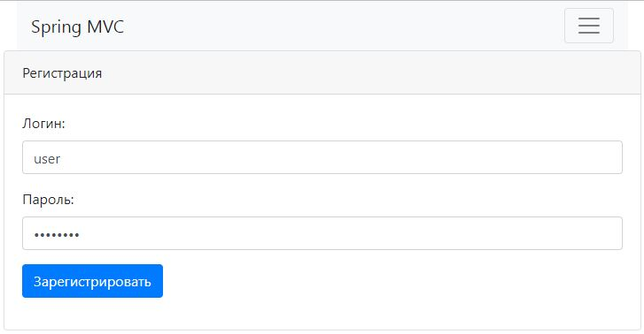
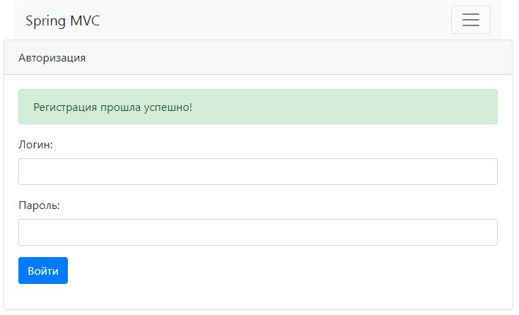
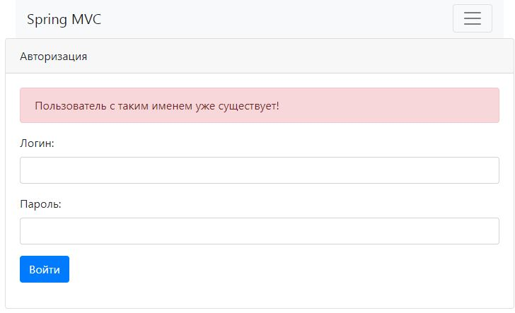

# Проект - "Автонарушители"

## Общая информация.

Проект разработан с целью улучшения навыков работы с различными стеками технологий
и представляет собой сервис по регистрации автонарушений.
При необходимости функционал проекта можно расширить.

Главная страница является таблицей с поиском. 

В системе существует две роли:

1. Пользователь - добавляет заявку с описанием автонарушений;
2. Автоинспектор - принимает, отклоняет, закрывает заявку.

Заявка имеет три статуса:

- Принята;
- Отклонена;
- Завершена.

Для корректной работы приложения необходимо установить следующие программы:

- Java 16 или выше;
- PostgreSQL 14 или выше;
- Apache Maven 3.8.3 или выше.

## Пример функционирования.

### 1. Регистрация/Авторизация пользователя:

  
Пример успешной регистрации:

  
  

  
Пример неудачной регистрации одного и того же пользователя два раза:

  
  

## Технологии

